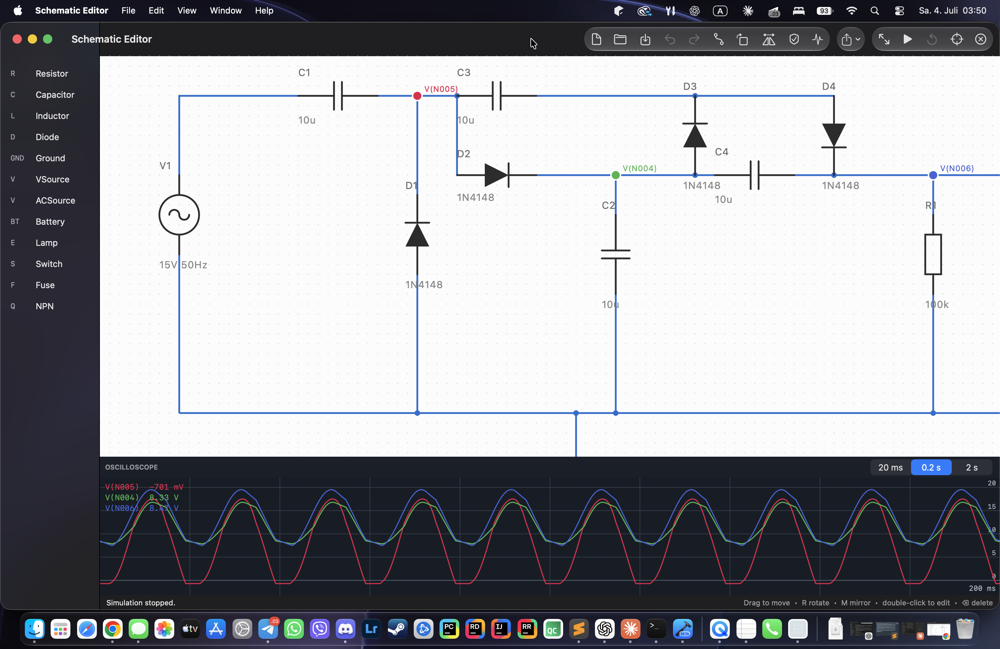

# Schematic Editor for macOS

A native macOS port of my C#/WPF schematic editor: Swift + AppKit/SwiftUI, zero external
dependencies, sharing the exact same `.schem.json` file format — schematics created on
Windows (probes included) open here unchanged, and vice versa.

## Screenshot



## What works

- **Editing**: symbol palette (IEC 60617), placement with rotate (`R`) / mirror (`M`),
  orthogonal wire routing with the pin/wire endpoint rule, selection, drag with grid
  snapping, rubber-band, undo/redo (`⌘Z` / `⇧⌘Z`), double-click properties.
- **Live simulation**: the same MNA transient engine — backward-Euler companion models,
  piecewise-linear diode with state iteration, clickable switches, lamps glowing with real
  dissipated power, fuses blowing on overcurrent, Shift+scroll value tweaking on a running
  circuit (1–2.2–4.7 ladder, state carries through).
- **Oscilloscope**: rolling traces, range-based autoscale on a 1-2-5 ladder, 20 ms / 0.2 s /
  2 s windows, probes placeable before or during a run, saved into the file.
- **AC analysis with Bode plots**: the AC toolbar button sweeps 1 Hz – 100 kHz over the
  voltage probes and opens a window with log-log magnitude and phase — one complex MNA
  solve per frequency point over the same topology as the transient engine.
- **Exporters**: handwritten DXF R12 and SVG (Export menu in the toolbar), identical
  conventions to the Windows editor.
- **Netlist + ERC**, cross-probing highlight of the selected wire's net.

## Building

Requires Xcode 16+ (macOS 14+). No project file needed — this is a plain Swift package:

```sh
open Package.swift        # or: File → Open… the folder in Xcode
```

Pick the **SchematicApp** scheme and run. Or from the terminal:

```sh
swift run SchematicApp    # launch the editor
swift test                # analytic verification suite
./make-app.sh             # assemble a proper SchematicApp.app bundle
```

Running as a bare SPM executable works but logs harmless bundle-related console noise;
`make-app.sh` builds a release binary and wraps it into a signed (ad-hoc) `.app` with a
bundle identifier, which silences the noise and gives the editor a Dock presence.

## The verification story

The math is a line-by-line port of a C# core that is verified against analytic solutions.
The XCTest suite re-checks the same references on this side: the RC charging curve hits
10·(1−e⁻¹) at t=τ, the divider midpoint is exact, the rectifier peak is A−0.7, separate
grounds merge into one reference, the AC solve gives −3 dB and −45° exactly at the RC corner
frequency and Q·A at the RLC resonance peak, and a file produced verbatim by the WPF editor
loads with every flag intact. If `swift test` is green, the port's physics is the physics.

## Layout

| Target | Contents |
|---|---|
| `SchematicCore` | Geometry, symbol library, document + undo, netlist + ERC, units, MNA simulation (transient + AC), JSON I/O, SVG export. Pure Swift, no AppKit. |
| `SchematicApp` | AppKit canvas (`NSView` custom drawing — the macOS analogue of the WPF `OnRender` approach), scope view, SwiftUI shell. |
| `SchematicCoreTests` | The analytic reference suite. |

`examples/` contains ready-made circuits with pre-placed probes — the same files the
Windows editor ships with.
